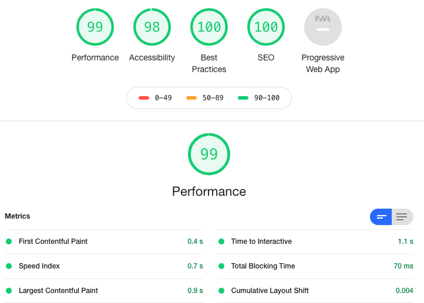

## [Gatsby Pizza](https://pizza-gatsby.netlify.app/)  check it out! :point_left:

### Gatsby site using sanity io as the headless CMS
- check out `/beers` for example of API call using gatsby 

[Sanity doc for rebuilding](https://www.sanity.io/blog/how-to-quickly-set-up-a-gatsby-js-jamstack-website-with-a-headless-cms#trigger-new-netlify-builds-on-content-changes-52f5edfa3342)

## lighthouse result

